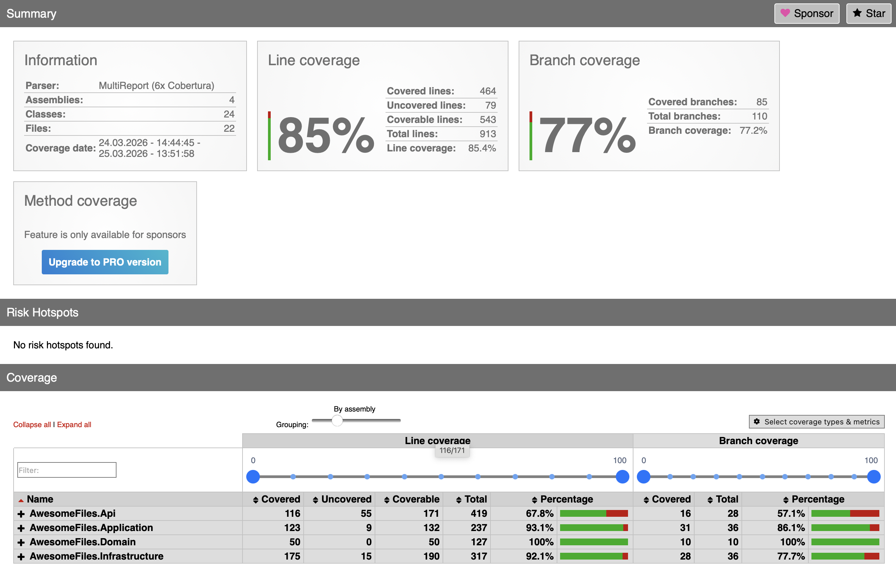

# Awesome Files

Асинхронный сервис архивирования файлов. REST API + CLI-клиент.  
.NET 9, Clean Architecture, Docker, PostgreSQL для логов.

---

## 📋 Оглавление

- [Архитектура](#-архитектура)
- [Технологии](#-технологии)
- [Запуск](#-запуск)
- [API](#-api)
- [CLI-клиент](#-cli-клиент)
- [Тестирование](#-тестирование)
- [Docker](#-docker)
- [Безопасность](#-безопасность)

---

## 🏗 Архитектура

Clean Architecture с чётким разделением ответственности:

| Слой | Ответственность |
|------|-----------------|
| **Domain** | Сущности, статусы, бизнес-правила |
| **Application** | Use cases, DTO, порты (интерфейсы) |
| **Infrastructure** | Файловая система, очередь, архивация, кэш |
| **API** | Контроллеры, middleware, Swagger |
| **Client** | CLI-клиент (System.CommandLine) |
| **Tests** | Unit-тесты (xUnit, Moq) |

### Ключевые технические решения

| Решение | Назначение |
|---------|------------|
| `BackgroundService` + `ConcurrentQueue` + `SemaphoreSlim` | Асинхронная очередь задач |
| `ConcurrentDictionary` | In-memory хранилище задач и кэш архивов |
| `lock` в `ArchiveTask` | Потокобезопасное изменение статуса |
| `Path.GetFullPath` + `StartsWith` | Защита от path traversal |
| `Serilog` | Структурированное логирование в консоль и PostgreSQL |
| `System.CommandLine` | POSIX-совместимый CLI |

---

## 🛠 Технологии

| Компонент | Стек |
|-----------|------|
| **Backend** | .NET 9, ASP.NET Core, Serilog |
| **CLI** | System.CommandLine, HttpClient |
| **База** | PostgreSQL 15 (логи) |
| **Контейнеризация** | Docker, Docker Compose |
| **Тесты** | xUnit, Moq, FluentAssertions, ReportGenerator |

---

## 🚀 Запуск

### Docker (рекомендуется)

```
git clone https://github.com/fairwix/Awesome-Files.git
cd AwesomeFiles
docker compose up --build
```

После запуска:

- **API:** http://localhost:5001
- **Swagger:** http://localhost:5001/swagger

### Локально

```
cd AwesomeFiles.Api
dotnet run
```

---

## 📡 API

| Метод | URL | Описание |
|-------|-----|----------|
| GET | `/api/files` | Список файлов |
| POST | `/api/archives` | Создать архив → `{ "id": "..." }` |
| GET | `/api/archives/{id}` | Статус задачи |
| GET | `/api/archives/{id}/download` | Скачать архив |

**Статусы:** `Pending` → `InProgress` → `Completed` / `Failed`  
**Коды ответов:** `200`, `202`, `400`, `404`, `500`

---

## 💻 CLI-клиент

POSIX-совместимая утилита с авто-режимом.

```bash
dotnet run --project AwesomeFiles.Client
```

| Команда | Пример | Описание |
|---------|--------|----------|
| `list` | `list` | Список файлов |
| `create-archive` | `create-archive file1.txt file2.txt` | Создать архив → ID |
| `status` | `status <id>` | Статус задачи |
| `download` | `download <id> ./downloads` | Скачать архив |
| `auto` | `auto file1.txt file2.txt ./downloads` | Создать → ждать → скачать |

**ENV:** `AWESOME_FILES_API_URL` (по умолчанию `http://localhost:5083`)

---

## 🧪 Тестирование

```bash
dotnet test
```

| Показатель | Значение |
|------------|----------|
| Line coverage | **85%** |
| Branch coverage | **77%** |



### Генерация отчёта о покрытии

```bash
dotnet test --collect:"XPlat Code Coverage" --results-directory ./coverage
reportgenerator -reports:./coverage/**/coverage.cobertura.xml -targetdir:./coverage/report -reporttypes:Html
open ./coverage/report/index.html
```

**Что покрыто:** Use Cases, сервисы, контроллеры, middleware, клиент (ApiClient, ArchiveClientService)

---

## 📦 Docker

Multi-stage сборка, non-root пользователь.

```bash
docker compose up --build
```

| Сервис | Назначение |
|--------|------------|
| `api` | ASP.NET Core |
| `logsdb` | PostgreSQL 15 (логи) |

**Volumes:**

| Хост | Контейнер |
|------|-----------|
| `./Files` | `/app/Files` |
| `./Archives` | `/app/Archives` |

---

## 🔒 Безопасность

| Мера защиты | Реализация |
|-------------|------------|
| Path traversal | `Path.GetFullPath` + `StartsWith` |
| Валидация входных данных | Проверка на `null` и пустые значения |
| Лимит запросов | Не более 50 файлов за раз |
| Отмена операций | `CancellationToken` во всех async методах |
| Контейнер | Non-root пользователь в Docker |
| Ошибки | Middleware с HTTP-статусами 400/404/500 |

---
